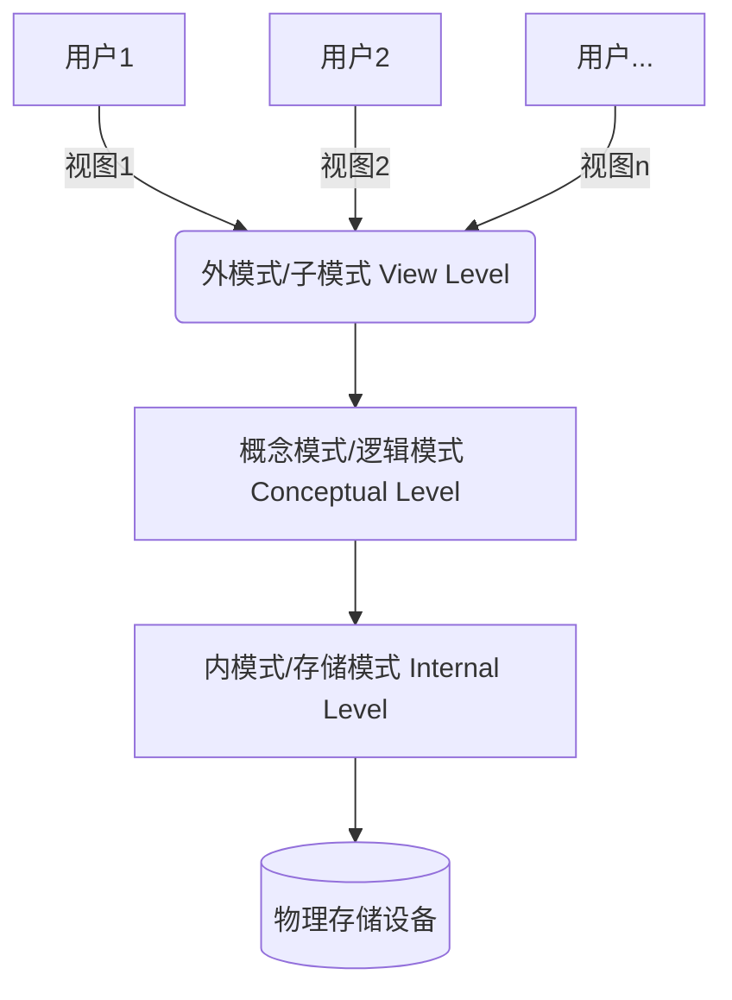

# 数据库
## 1. 概述
### 1.1 数据库
数据库 (Database) 是长期存储在计算机内的、有组织的、可共享的大量数据的集合。

### 1.2 数据库管理系统
数据库管理系统 (Database Management System) 是一种操纵和管理数据库的大型软件，用于建立、使用和维护数据库，简称 DBMS。

**DBMS 按数据模型划分:**
 - 关系模型 DBMS：MySQL，Oracle，SQL Server。
 - 文档性 DBMS：MongoDB。
 - 键值型 DBMS：Redis。
 - 对象型 DBMS：ObjectDB，db4o。

### 1.3 数据库系统
数据库系统是由数据库、数据库管理系统、应用程序和数据库管理员组成的系统。 

## 2. 数据库模式与范式


### 2.1 三级模式
* 外模式（用户模式）：用户与数据库系统的接口，由若干个外部记录类型组成
* 模式（概念模式）：数据库中全体数据的逻辑结构和特征的描述，由若干个概念记录类型组成，只涉及行的描述，不涉及具体的值。
* 内模式（存储模式）：数据物理结构和存储方式的描述，是数据在数据库内部的表示方式，定义所有的内部记录类型、索引和文件的组织方式以及数据控制方面的细节。

### 2.2 两级映像
数据库系统在三级模式之间提供了两级映像。
* 模式/内模式映像 。该映像存在于概念级和内部级之间，实现了概念模式到内模式之间的相互转换。（ 物理独立性 ）
* 外模式/模式映像 。该映像存在于外部级和概念级之间，实现了外模式到概念模式之间的相互转换。（ 逻辑独立性 ）

### 2.3 数据库规范化
关系模型满足的确定约束条件称为范式，根据满足约束条件的级别不同，范式由低到高依次为：1NF、2NF、3NF、BCNF 等。
将第一级的关系模式转换为第二级的关系模式的过程称为规范化。规范化需要遵循两个准则：
* 无损连接性。信息不失真（不增减信息）
* 函数依赖保持性，不破坏属性间存在的依赖关系。

#### 2.3.1 函数依赖

函数依赖：设 X、Y 是关系模式 R 的属性集，X -> Y 表示 X 决定 Y。

例如：记录职工信息的结构如下：
```
职工工号（EMP_NO）
职工姓名（EMP_NMAE）
所在部门（DEPT）。
则说 EMP_NO 函数决定 EMP_NMAE 和 DEPT，或者说 EMP_NMAE，DEPT 函数依赖
于 EMP_NO，记为：EMP_NO -> EMP_NMAE，EMP_NO -> DEPT。
```
#### 2.3.2 范式

* 第一范式（1NF）：属性不可分。

| 职工工号 | 职工姓名 | 住址 (不满足 1NF) |
|---------|---------|------|
| 32060231 | 张晓明 | 江苏省南通市人民路 56 号[226001]|

住址可以拆分，不满足 1NF。

* 第二范式（2NF）：范式属于 1NF，并且所有非主属性都完全函数依赖于主键。

| 学号 | 课程号 | 学生姓名 | 课程名称 | 成绩 | 学分 |
| ---- | ------ | -------- | -------- | ---- | ---- |
| 2001 | C001   | 张三     | 数据库   | 90   | 3    |

主键（学号，课程号），学生姓名 -> 学号，课程名称 -> 课程号。不是完全依赖于主键（学号，课程号）。

* 第三范式（3NF）：要求消除非主属性对主键的传递依赖。

| 学号 | 课程号 | 学生姓名 | 系名     | 系主任 |
| ---- | ------ | -------- | -------- | ------ |
| 2001 | C001   | 张三     | 计算机系 | 王主任 |

存在以下依赖关系：（学号，课程号）→ 学生姓名，（学号，课程号）→ 系名，系名 → 系主任。

* 巴斯-科德范式（BCNF）：属性不传递依赖于主键，且所有非主属性都与主键有完全依赖关系。

将传递依赖分表进行存储。

## 3. 数据库设计
基于 3NF 的数据库设计方法

| 阶段 | 任务 | 关键步骤 |
|------|------|----------|
| **需求分析** | 收集用户需求 | 确定数据需求、业务规则、功能需求 |
| **概念结构设计** | 设计E-R图 | 识别实体、属性、关系，构建实体-关系模型 |
| **逻辑结构设计** | 规范化处理（3NF） | 将E-R图转换为关系模式，消除冗余（1NF→2NF→3NF） |
| **存储模式设计** | 优化存储与查询 | 设计表结构、索引、查询优化策略 |
| **物理结构设计** | 确定物理存储方案 | 选择存储介质、分配存储空间、优化I/O性能 |
| **数据库实现** | 创建数据库并导入数据 | 建库、建表、数据迁移、完整性约束 |

## 4. 数据库保护

### 4.1 事务
数据库系统运行的基本工作单位是事务。事务相当于操作系统中的进程，是用户定义的一个操作序列，这些操作序列要么全部执行，要么全部不执行，是一个不可分割的工作单位。事务具有以下特征：
- 原子性：数据库的逻辑工作单位。
- 一致性：事务必须使数据库从一个一致性状态变换到另一个一致性状态。
- 隔离性：一个事务的执行不能被其他事务干扰。
- 持续性：一个事务一旦提交，它对数据库中数据的改变就应该是永久性的。

事务通常以 BEGIN TRANSACTION（事务开始）语句开始，以 COMMIT 或 ROLLBACK 语句结束。

### 4.2 保护措施
数据库保护的 4 种措施：
- 数据库的恢复：备份数据库，在发生灾难时，恢复数据库。
    - 备份恢复: 全量备份，增量备份，差异备份。
    - 日志恢复: 1. 重做日志: 记录事务对数据的修改。 2.撤销日志：记录事务修改前的数据。
- 并发控制：并发操作是指在多用户共享的系统中，许多用户可能同时对同一数据进行操作。
    - 排他锁（X锁）：事务对数据加上 X 锁后，只能读取和修改数据，其他事务不能加任何锁。
    - 共享锁（S锁）：事务对数据加上 S 锁后，只能读取数据，其他事务也只能加 S 锁。
- 完整性控制：
    - 实体完整性：主键约束，确保每个实体的唯一性
    - 参照完整性：外键约束，确保实体间引用的正确性
    - 用户定义完整性：符合应用语义的约束条件
    - 域完整性：属性值必须满足数据类型、格式等约束
- 安全控制：
    - 用户身份鉴别：用户登录时，系统验证用户的身份。
    - 授权控制：用户对数据库的访问权限。
    - 数据加密：传输加密、存储加密、备份加密。

## 5. SQL 语言
- [SQL 语言](./sql.md)

## 6. NoSQL 数据库
### 6.1 概述
NoSQL 数据库是一种非关系型数据库，它的特点是不使用传统的关系型数据库的行列模型，而是使用键值对、文档型、图形型等模型。NoSQL 数据库的优点是可以存储大量的数据，并且可以根据需要进行扩展。NoSQL 数据库的缺点是不支持事务，不支持复杂的查询，不支持 ACID 事务。举例: Redis，MongoDB。
### 6.2

