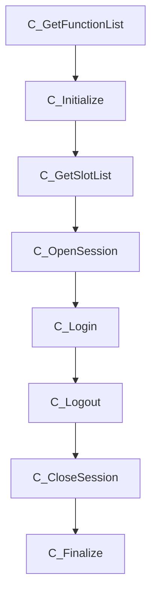

## 1. PKCS11 简介
PKCS11是一种用于安全访问硬件加密设备的应用程序接口（API）标准。它定义了一组函数和数据结构，使应用程序能够与硬件加密设备进行交互，执行加密、解密、签名和验证等操作。

## 2. PKCS11 的核心概念

### 2.1 基础组件
* 槽位（Slot）：代表物理或逻辑设备接口，如USB读卡器的插槽。
    * 单个 USB Key 设备: 1 个 Slot
    * 智能卡读卡器: 可能有 1 ~ 4 个 Slot
    * 软件 HSM: 1 ~ 2 个 Slot
    * 硬件 HSM: 多个 Slot, 但一般不会超过 10 个 Slot
* 令牌（Token）：槽位上的密码设备，如HSM或智能卡。
* 会话（Session）：应用程序与令牌之间的通信通道，分为"公共会话"和"用户会话"。
* 对象（Object）：令牌中存储的数据实体，如密钥、证书、数据对象。对象通过属性（Attribute）定义其类型和访问权限。
    * 访问权限：共有对象，私有对象。
    * 状态类型：临时会话，持久会话。
* 用户（User）：与令牌进行交互的实体，如管理员、普通用户。
    * Security Officer (管理员)：初始化令牌，设置密码，重置密码，更新固件等管理操作。
    * Normal Users (普通用户)：生成密钥，签名，加密，解密，证书管理，密钥管理。

### 2.2 PKCS11 前缀命名规范
PKCS11 API 使用特定的前缀来区分不同类型的函数和数据：

* C_：加密函数（Cryptographic function）
* CK_：数据类型或常量（Data Type or constant）
* CKA_：密钥属性（Attribute of a key）
* CKM_：加密机制/算法（Mechanisms/Algorithms）
* CKO_：对象类（Class of an Object）
* CKK_：密钥类型（Type of key）
* CKR_：函数返回码（Return Code from a function）
* CKU_：用户类型（User Type）
* CKF_：标志（Flag）

## 2.5 调用流程


## 3. SoftHsm 

- 为什么需要PKCS#11
- 解决了什么问题
- 带来什么好处

## 4. PKCS11 实现和使用

### 4.1 工具安装
基于 Ubuntu 安装 pkcs11-tool：
```bash
sudo apt install opensc1
```

查看当前可用模块：
pkcs11-tool --module ./libgm3000_pkcs11.so --list-object

pkcs11-tool --module ./libgm3000_pkcs11.so --list-object --pin 12345678

签名：
pkcs11-tool --module ./libgm3000_pkcs11.so --login --sign --mechanism SHA256-RSA-PKCS --input input_file --output signed_file --pin 12345678
验证签名：
pkcs11-tool --module./libgm3000_pkcs11.so --login --verify --mechanism SHA256-RSA-PKCS --input input_file --signature signed_file --pin 12345678
加密：
pkcs11-tool --module./libgm3000_pkcs11.so --login --encrypt --mechanism RSA-OAEP --input input_file --output encrypted_file --pin 12345678
解密：
pkcs11-tool --module./libgm3000_pkcs11.so --login --decrypt --mechanism RSA-OAEP --input encrypted_file --output decrypted_file --pin 12345678


- 如何实现PKCS#11
- 如何使用PKCS#11
- 开发示例和最佳实践
## 5. PKCS11 实现步骤
- 性能影响
- 资源消耗
- 成本考虑

参考资料：

* 规范
    * [PKCS #11 加密令牌接口基本规范版本 2.40](https://docs.oasis-open.org/pkcs11/pkcs11-base/v2.40/errata01/os/pkcs11-base-v2.40-errata01-os-complete.html)
    * [PKCS #11 URI Scheme](https://www.rfc-editor.org/rfc/rfc7512)
* 代码 
    * [PKCS #11 provider 应用](https://github.com/embetrix/pkcs11-provider-example)
    * [PKCS #11 Tool and Opensssl](https://github.com/OpenSC/OpenSC/wiki/Using-pkcs11-tool-and-OpenSSL)
* 资料
    * [PKCS #11 youtube](https://www.youtube.com/watch?v=zTt9wp5vXDE&list=PLgBMtP0_D_aec5yMhAmcjmeFoJGwfgLKy)  
    * [Cryptographic Token Interface Standard (https://www.cryptsoft.com/pkcs11doc/v220/)](https://www.cryptsoft.com/pkcs11doc/v220/)