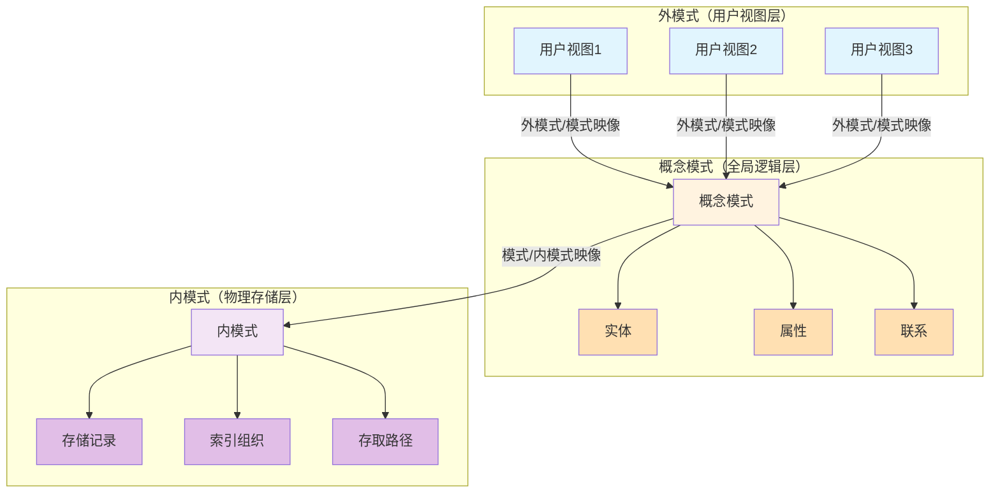

# 数据库
## 1. 概述
### 1.1 数据库
数据库 (Database) 是长期存储在计算机内的、有组织的、可共享的大量数据的集合。

### 1.2 数据库管理系统
数据库管理系统 (Database Management System) 是一种操纵和管理数据库的大型软件，用于建立、使用和维护数据库，简称 DBMS。
DBMS 按数据模型划分: 
 - 关系模型 DBMS：MySQL，Oracle，SQL Server。
 - 文档性 DBMS：MongoDB。
 - 键值型 DBMS：Redis。
 - 对象型 DBMS：ObjectDB，db4o。

### 1.3 数据库系统
数据库系统是由数据库、数据库管理系统、应用程序和数据库管理员组成的系统。 

## 2. 关数据库模式与范式

### 2.1 数据库模式

## 4. 数据库设计

## 5. 数据库保护
数据库保护的 4 中措施：数据库的恢复、并发控制、完整性控制和安全控制。

## 6. SQL 语言
- 关系数据库
- [SQL 语言](./sql.md)
- 数据库设计
- 事务处理
- 并发控制
- 数据库恢复
- 数据库安全